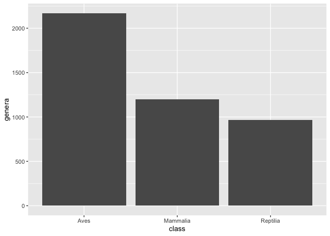
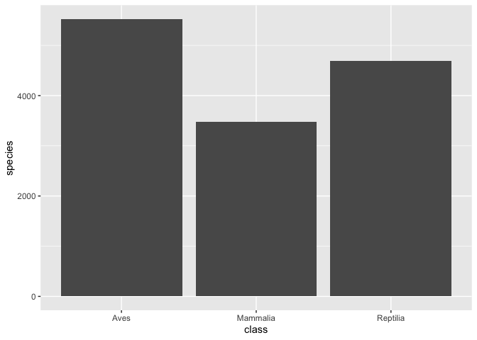
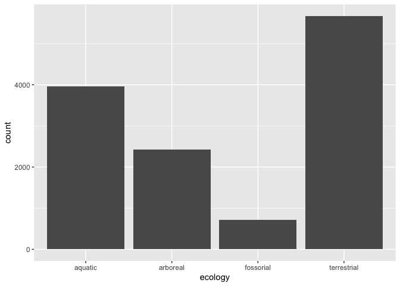
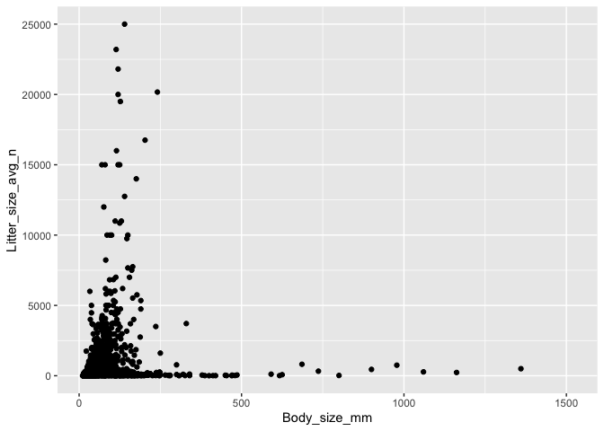
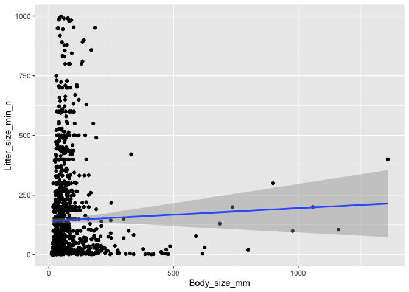

### Libraries

```r
library(tidyverse)
library(naniar)
library(skimr)
```

### Data

### amniota data
Myhrvold N, Baldridge E, Chan B, Sivam D, Freeman DL, Ernest SKM (2015). “An amniote life-history
database to perform comparative analyses with birds, mammals, and reptiles.” _Ecology_, *96*, 3109.
doi: 10.1890/15-0846.1 (URL: https://doi.org/10.1890/15-0846.1).

```r
amniota <- 
  readr::read_csv("data/amniota.csv")
```

### amphibio data
Oliveira BF, São-Pedro VA, Santos-Barrera G, Penone C, Costa GC (2017). “AmphiBIO, a global database
for amphibian ecological traits.” _Scientific Data_, *4*, 170123. doi: 10.1038/sdata.2017.123 (URL:
https://doi.org/10.1038/sdata.2017.123).

```r
amphibio <- 
  readr::read_csv("data/amphibio.csv")
```

### Questions  
**1. First, do some exploratory analysis of both data sets. What is the structure, column names, and dimensions?**  

```r
glimpse(amniota)
```

```
## Observations: 21,322
## Variables: 36
## $ class                                 <chr> "Aves", "Aves", "Aves", "Aves",<U+2026>
## $ order                                 <chr> "Accipitriformes", "Accipitrifo<U+2026>
## $ family                                <chr> "Accipitridae", "Accipitridae",<U+2026>
## $ genus                                 <chr> "Accipiter", "Accipiter", "Acci<U+2026>
## $ species                               <chr> "albogularis", "badius", "bicol<U+2026>
## $ subspecies                            <dbl> -999, -999, -999, -999, -999, -<U+2026>
## $ common_name                           <chr> "Pied Goshawk", "Shikra", "Bico<U+2026>
## $ female_maturity_d                     <dbl> -999.000, 363.468, -999.000, -9<U+2026>
## $ litter_or_clutch_size_n               <dbl> -999.000, 3.250, 2.700, -999.00<U+2026>
## $ litters_or_clutches_per_y             <dbl> -999, 1, -999, -999, 1, -999, -<U+2026>
## $ adult_body_mass_g                     <dbl> 251.500, 140.000, 345.000, 142.<U+2026>
## $ maximum_longevity_y                   <dbl> -999.00000, -999.00000, -999.00<U+2026>
## $ gestation_d                           <dbl> -999, -999, -999, -999, -999, -<U+2026>
## $ weaning_d                             <dbl> -999, -999, -999, -999, -999, -<U+2026>
## $ birth_or_hatching_weight_g            <dbl> -999, -999, -999, -999, -999, -<U+2026>
## $ weaning_weight_g                      <dbl> -999, -999, -999, -999, -999, -<U+2026>
## $ egg_mass_g                            <dbl> -999.00, 21.00, 32.00, -999.00,<U+2026>
## $ incubation_d                          <dbl> -999.00, 30.00, -999.00, -999.0<U+2026>
## $ fledging_age_d                        <dbl> -999.00, 32.00, -999.00, -999.0<U+2026>
## $ longevity_y                           <dbl> -999.00000, -999.00000, -999.00<U+2026>
## $ male_maturity_d                       <dbl> -999, -999, -999, -999, -999, -<U+2026>
## $ inter_litter_or_interbirth_interval_y <dbl> -999, -999, -999, -999, -999, -<U+2026>
## $ female_body_mass_g                    <dbl> 352.500, 168.500, 390.000, -999<U+2026>
## $ male_body_mass_g                      <dbl> 223.000, 125.000, 212.000, 142.<U+2026>
## $ no_sex_body_mass_g                    <dbl> -999.0, 123.0, -999.0, -999.0, <U+2026>
## $ egg_width_mm                          <dbl> -999, -999, -999, -999, -999, -<U+2026>
## $ egg_length_mm                         <dbl> -999, -999, -999, -999, -999, -<U+2026>
## $ fledging_mass_g                       <dbl> -999, -999, -999, -999, -999, -<U+2026>
## $ adult_svl_cm                          <dbl> -999.00, 30.00, 39.50, -999.00,<U+2026>
## $ male_svl_cm                           <dbl> -999, -999, -999, -999, -999, -<U+2026>
## $ female_svl_cm                         <dbl> -999, -999, -999, -999, -999, -<U+2026>
## $ birth_or_hatching_svl_cm              <dbl> -999, -999, -999, -999, -999, -<U+2026>
## $ female_svl_at_maturity_cm             <dbl> -999, -999, -999, -999, -999, -<U+2026>
## $ female_body_mass_at_maturity_g        <dbl> -999, -999, -999, -999, -999, -<U+2026>
## $ no_sex_svl_cm                         <dbl> -999, -999, -999, -999, -999, -<U+2026>
## $ no_sex_maturity_d                     <dbl> -999, -999, -999, -999, -999, -<U+2026>
```
<br>

```r
glimpse(amphibio)
```

```
## Observations: 6,776
## Variables: 38
## $ id                      <chr> "Anf0001", "Anf0002", "Anf0003", "Anf0004", "<U+2026>
## $ Order                   <chr> "Anura", "Anura", "Anura", "Anura", "Anura", <U+2026>
## $ Family                  <chr> "Allophrynidae", "Alytidae", "Alytidae", "Aly<U+2026>
## $ Genus                   <chr> "Allophryne", "Alytes", "Alytes", "Alytes", "<U+2026>
## $ Species                 <chr> "Allophryne ruthveni", "Alytes cisternasii", <U+2026>
## $ Fos                     <dbl> NA, NA, NA, NA, NA, 1, 1, 1, 1, 1, 1, 1, 1, N<U+2026>
## $ Ter                     <dbl> 1, 1, 1, 1, 1, 1, 1, 1, 1, 1, 1, 1, 1, 1, 1, <U+2026>
## $ Aqu                     <dbl> 1, 1, 1, 1, NA, 1, 1, 1, 1, 1, 1, 1, 1, 1, 1,<U+2026>
## $ Arb                     <dbl> 1, 1, 1, 1, 1, 1, NA, NA, NA, NA, NA, NA, NA,<U+2026>
## $ Leaves                  <dbl> NA, NA, NA, NA, NA, NA, NA, NA, NA, NA, NA, N<U+2026>
## $ Flowers                 <dbl> NA, NA, NA, NA, NA, NA, NA, NA, NA, NA, NA, N<U+2026>
## $ Seeds                   <lgl> NA, NA, NA, NA, NA, NA, NA, NA, NA, NA, NA, N<U+2026>
## $ Fruits                  <dbl> NA, NA, NA, NA, NA, NA, NA, NA, NA, NA, NA, N<U+2026>
## $ Arthro                  <dbl> 1, 1, 1, NA, 1, 1, 1, 1, 1, NA, 1, 1, NA, NA,<U+2026>
## $ Vert                    <dbl> NA, NA, NA, NA, NA, NA, 1, NA, NA, NA, 1, 1, <U+2026>
## $ Diu                     <dbl> 1, NA, NA, NA, NA, NA, 1, 1, 1, NA, 1, 1, NA,<U+2026>
## $ Noc                     <dbl> 1, 1, 1, NA, 1, 1, 1, 1, 1, NA, 1, 1, 1, NA, <U+2026>
## $ Crepu                   <dbl> 1, NA, NA, NA, NA, 1, NA, NA, NA, NA, NA, NA,<U+2026>
## $ Wet_warm                <dbl> NA, NA, NA, NA, 1, 1, NA, NA, NA, NA, 1, NA, <U+2026>
## $ Wet_cold                <dbl> 1, NA, NA, NA, NA, NA, 1, NA, NA, NA, NA, NA,<U+2026>
## $ Dry_warm                <dbl> NA, NA, NA, NA, NA, NA, NA, NA, NA, NA, NA, N<U+2026>
## $ Dry_cold                <dbl> NA, NA, NA, NA, NA, NA, NA, NA, NA, NA, NA, N<U+2026>
## $ Body_mass_g             <dbl> 31.00, 6.10, NA, NA, 2.31, 13.40, 21.80, NA, <U+2026>
## $ Age_at_maturity_min_y   <dbl> NA, 2.0, 2.0, NA, 3.0, 2.0, 3.0, NA, NA, NA, <U+2026>
## $ Age_at_maturity_max_y   <dbl> NA, 2.0, 2.0, NA, 3.0, 3.0, 5.0, NA, NA, NA, <U+2026>
## $ Body_size_mm            <dbl> 31.0, 50.0, 55.0, NA, 40.0, 55.0, 80.0, 60.0,<U+2026>
## $ Size_at_maturity_min_mm <dbl> NA, 27, NA, NA, NA, 35, NA, NA, NA, NA, NA, N<U+2026>
## $ Size_at_maturity_max_mm <dbl> NA, 36.0, NA, NA, NA, 40.5, NA, NA, NA, NA, N<U+2026>
## $ Longevity_max_y         <dbl> NA, 6, NA, NA, NA, 7, 9, NA, NA, NA, NA, NA, <U+2026>
## $ Litter_size_min_n       <dbl> 300, 60, 40, NA, 7, 53, 300, 1500, 1000, NA, <U+2026>
## $ Litter_size_max_n       <dbl> 300, 180, 40, NA, 20, 171, 1500, 1500, 1000, <U+2026>
## $ Reproductive_output_y   <dbl> 1, 4, 1, 4, 1, 4, 6, 1, 1, 1, 1, 1, 1, 1, NA,<U+2026>
## $ Offspring_size_min_mm   <dbl> NA, 2.6, NA, NA, 5.4, 2.6, 1.5, NA, 1.5, NA, <U+2026>
## $ Offspring_size_max_mm   <dbl> NA, 3.5, NA, NA, 7.0, 5.0, 2.0, NA, 1.5, NA, <U+2026>
## $ Dir                     <dbl> 0, 0, 0, 0, 0, 0, 0, 0, 0, 0, 0, 0, 0, 0, 0, <U+2026>
## $ Lar                     <dbl> 1, 1, 1, 1, 1, 1, 1, 1, 1, 1, 1, 1, 1, 1, 1, <U+2026>
## $ Viv                     <dbl> 0, 0, 0, 0, 0, 0, 0, 0, 0, 0, 0, 0, 0, 0, 0, <U+2026>
## $ OBS                     <lgl> NA, NA, NA, NA, NA, NA, NA, NA, NA, NA, NA, N<U+2026>
```
<br>
**2. How many total NAs are in each data set? Do these values make sense? Are NAs represented by any other values?**   

In the `amniota` dataset, NA values are represented as `-999` so they are not picked up by the `is.na()` function.


```r
amniota %>% 
  summarize(total_na = sum(is.na(amniota)))
```

```
## # A tibble: 1 x 1
##   total_na
##      <int>
## 1        0
```

In the `amphibio` dataset, NA values are represented as `NA`.
<br>

```r
amphibio %>% 
  summarize(total_na = sum(is.na(amphibio)))
```

```
## # A tibble: 1 x 1
##   total_na
##      <int>
## 1   170691
```


<br>

**3. Make any necessary replacements in the data such that all NAs appear as "NA".**   

We only need to fix the `amniota` dataset using the following command:

```r
amniota <- amniota %>% 
  na_if("-999")
```


<br>
**4. Use the package `naniar` to produce a summary, including percentages, of missing data in each column for both data sets.** 


```r
naniar::miss_var_summary(amphibio)
```

```
## # A tibble: 38 x 3
##    variable n_miss pct_miss
##    <chr>     <int>    <dbl>
##  1 OBS        6776    100  
##  2 Fruits     6774    100. 
##  3 Flowers    6772     99.9
##  4 Seeds      6772     99.9
##  5 Leaves     6752     99.6
##  6 Dry_cold   6735     99.4
##  7 Vert       6657     98.2
##  8 Wet_cold   6625     97.8
##  9 Crepu      6608     97.5
## 10 Dry_warm   6572     97.0
## # <U+2026> with 28 more rows
```
<br>

```r
naniar::miss_var_summary(amniota)
```

```
## # A tibble: 36 x 3
##    variable                       n_miss pct_miss
##    <chr>                           <int>    <dbl>
##  1 subspecies                      21322    100  
##  2 female_body_mass_at_maturity_g  21318    100. 
##  3 female_svl_at_maturity_cm       21120     99.1
##  4 fledging_mass_g                 21111     99.0
##  5 male_svl_cm                     21040     98.7
##  6 no_sex_maturity_d               20860     97.8
##  7 egg_width_mm                    20727     97.2
##  8 egg_length_mm                   20702     97.1
##  9 weaning_weight_g                20258     95.0
## 10 female_svl_cm                   20242     94.9
## # <U+2026> with 26 more rows
```


<br>
**5. For the `amniota` data, calculate the number of NAs in the `egg_mass_g` column sorted by taxonomic class; i.e. how many NAs are present in the `egg_mass_g` column in birds, mammals, and reptiles? Does this results make sense biologically? How do these results affect your interpretation of NAs?**  


```r
amniota %>% 
  select(class, egg_mass_g) %>% 
  group_by(class)  %>% 
  naniar::miss_var_summary()
```

```
## # A tibble: 3 x 4
## # Groups:   class [3]
##   class    variable   n_miss pct_miss
##   <chr>    <chr>       <int>    <dbl>
## 1 Aves     egg_mass_g   4914     50.1
## 2 Mammalia egg_mass_g   4953    100  
## 3 Reptilia egg_mass_g   6040     92.0
```

It makes sense that Mammalia would have most/all its `egg_mass_g` data missing since most mammals do not lay eggs. However, I would epxect that Aves would have more of its data present.
<br>
**6. Which taxonomic classes are represented in the data? Summarize this in a chart then make a barplot that shows the proportion of observations in each taxonomic class.**

Birds, Mammals and Reptiles are represented in the `amniota` dataset.


```r
amniota %>% 
  group_by(class) %>% 
  ggplot(mapping = aes(x=class))+geom_bar(stat="count")
```

<!-- -->


<br>
**7. Let's explore the taxonomic composition of the data a bit more. How many genera are represented by taxonomic class? Present this as a data table and bar plot.**


```r
amniota_genera_by_class <- amniota %>% 
  group_by(class) %>%
  summarise(
   genera = n_distinct(genus))
```


```r
amniota_genera_by_class
```

```
## # A tibble: 3 x 2
##   class    genera
##   <chr>     <int>
## 1 Aves       2169
## 2 Mammalia   1200
## 3 Reptilia    967
```

<br>


```r
ggplot(amniota_genera_by_class,  mapping=aes(x=class, y=genera))+geom_bar(stat="identity")
```

<!-- -->


**8. Lastly, how many species are represented in each taxonomic class? Present this as a data table and bar plot.**


```r
amniota_species_by_class <- amniota %>% 
  group_by(class) %>% 
  summarise(species = n_distinct(species))
```


```r
amniota_species_by_class
```

```
## # A tibble: 3 x 2
##   class    species
##   <chr>      <int>
## 1 Aves        5525
## 2 Mammalia    3473
## 3 Reptilia    4692
```


```r
ggplot(amniota_species_by_class,  mapping=aes(x=class, y=species))+geom_bar(stat="identity")
```

<!-- -->


**9. The `amphibio` data includes information on ecology. Each species is classified as fossorial, terrestrial, aquatic, or arboreal. How many species are in each of these categories? Make a bar plot to visualize these results. Which category is most/ least represented in the data?**


```r
amphibio_by_eco <- amphibio %>% 
  summarize(
    fossorial = sum(Fos, na.rm=TRUE),
    terrestrial= sum(Ter, na.rm=TRUE),
    aquatic= sum(Aqu,na.rm=TRUE),
    arboreal= sum(Arb,na.rm=TRUE)) %>% 
  pivot_longer(fossorial:arboreal,
    names_to = "ecology",
    values_to = "count"
  )
```


```r
amphibio_by_eco
```

```
## # A tibble: 4 x 2
##   ecology     count
##   <chr>       <dbl>
## 1 fossorial     723
## 2 terrestrial  5672
## 3 aquatic      3966
## 4 arboreal     2429
```


```r
ggplot(amphibio_by_eco, mapping = aes(x=ecology, y=count))+geom_bar(stat="identity")
```

<!-- -->

Terrestrial amphibians are the most represented whilist fossorial are the least represented.


<br>
**10. For the amphibio data, we are interested to know if body size is correlated with litter size? Make a plot that shows this relationship. You should notice that there are outliers. Can you think of a way to identify the outliers for both body size and litter size? What happens when you then re-plot the data?**


```r
amphibio %>%
  select(Body_size_mm, Litter_size_min_n, Litter_size_max_n) %>%
  rowwise() %>% mutate(Litter_size_avg_n = mean(c(Litter_size_min_n, Litter_size_max_n),  na.rm=TRUE)) %>% 
  ggplot(amphibio_plot, mapping=aes(x=Body_size_mm, y=Litter_size_avg_n))+geom_jitter()
```

<!-- -->

<br>
We can filter out  all values of `litter_size_avg_n` above 1000 to see if any relationship exists. It would  appear as if no clear relationship exists.


```r
amphibio %>% 
  select(Litter_size_min_n, Body_size_mm) %>% 
  filter(Litter_size_min_n < 1000) %>% 
  ggplot(mapping=aes(x=Body_size_mm, y=Litter_size_min_n))+geom_jitter()+geom_smooth(method=lm, se=T)
```

<!-- -->
<br><br><br>


