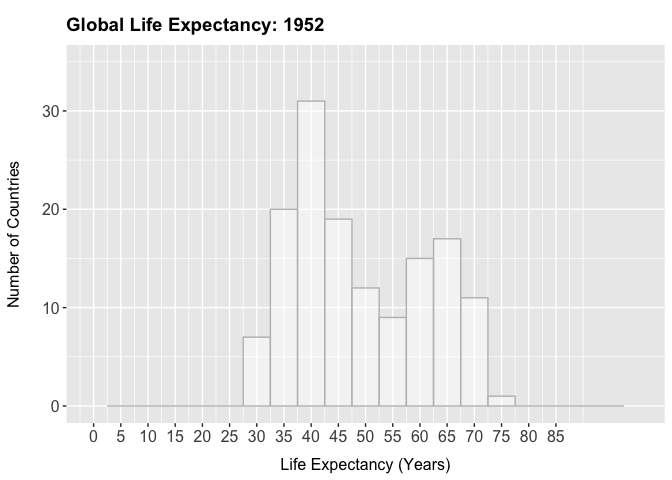
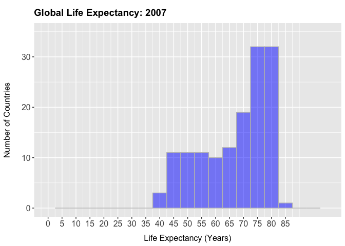

### Libraries

```r
#install.packages("tidyverse")
#install.packages("naniar")
#install.packages("gapminder")
#install.packages("knitr")
#install.packages("kableExtra")


library(tidyverse)
library(naniar)
library(gapminder)
library(knitr)
library(kableExtra)
```


```r
# This file uses libraries designed to output clean tables. For best viewing, open lab6_hw.html
```


### Questions

**1. Use the function(s) of your choice to get an idea of the overall structure of the data frame, including its dimensions, column names, variable classes, etc. As part of this, determine how NAs are treated in the data.**


```r
gapminder <- gapminder
```

```r
glimpse(gapminder)
```

```
## Observations: 1,704
## Variables: 6
## $ country   <fct> Afghanistan, Afghanistan, Afghanistan, Afghanistan, Afghani…
## $ continent <fct> Asia, Asia, Asia, Asia, Asia, Asia, Asia, Asia, Asia, Asia,…
## $ year      <int> 1952, 1957, 1962, 1967, 1972, 1977, 1982, 1987, 1992, 1997,…
## $ lifeExp   <dbl> 28.801, 30.332, 31.997, 34.020, 36.088, 38.438, 39.854, 40.…
## $ pop       <int> 8425333, 9240934, 10267083, 11537966, 13079460, 14880372, 1…
## $ gdpPercap <dbl> 779.4453, 820.8530, 853.1007, 836.1971, 739.9811, 786.1134,…
```

<br>


```r
any_na(gapminder)
```

```
## [1] FALSE
```
It  would appear that no NA values are present, as `NA` or any other common inputs for NA.

<br><br>
**2. Among the interesting variables in gapminder is life expectancy. How has global life expectancy changed between 1952 and 2007?**

Processing the data

```r
global_lifeExp <- gapminder %>% 
  select(country, year, lifeExp)  %>% 
  filter(year>=1952 & year<=2007) %>% 
  group_by(year) %>% 
  summarize(lifeExp_avg = mean(lifeExp))
```

<br>
`lifeExp_avg` summarized in a table

```r
kable(global_lifeExp) %>% 
  kable_styling(bootstrap_options = "striped", full_width = F, position="left")
```

<table class="table table-striped" style="width: auto !important; ">
 <thead>
  <tr>
   <th style="text-align:right;"> year </th>
   <th style="text-align:right;"> lifeExp_avg </th>
  </tr>
 </thead>
<tbody>
  <tr>
   <td style="text-align:right;"> 1952 </td>
   <td style="text-align:right;"> 49.05762 </td>
  </tr>
  <tr>
   <td style="text-align:right;"> 1957 </td>
   <td style="text-align:right;"> 51.50740 </td>
  </tr>
  <tr>
   <td style="text-align:right;"> 1962 </td>
   <td style="text-align:right;"> 53.60925 </td>
  </tr>
  <tr>
   <td style="text-align:right;"> 1967 </td>
   <td style="text-align:right;"> 55.67829 </td>
  </tr>
  <tr>
   <td style="text-align:right;"> 1972 </td>
   <td style="text-align:right;"> 57.64739 </td>
  </tr>
  <tr>
   <td style="text-align:right;"> 1977 </td>
   <td style="text-align:right;"> 59.57016 </td>
  </tr>
  <tr>
   <td style="text-align:right;"> 1982 </td>
   <td style="text-align:right;"> 61.53320 </td>
  </tr>
  <tr>
   <td style="text-align:right;"> 1987 </td>
   <td style="text-align:right;"> 63.21261 </td>
  </tr>
  <tr>
   <td style="text-align:right;"> 1992 </td>
   <td style="text-align:right;"> 64.16034 </td>
  </tr>
  <tr>
   <td style="text-align:right;"> 1997 </td>
   <td style="text-align:right;"> 65.01468 </td>
  </tr>
  <tr>
   <td style="text-align:right;"> 2002 </td>
   <td style="text-align:right;"> 65.69492 </td>
  </tr>
  <tr>
   <td style="text-align:right;"> 2007 </td>
   <td style="text-align:right;"> 67.00742 </td>
  </tr>
</tbody>
</table>
<br>

`lifeExp_avg` summarized as a line graph

```r
ggplot(global_lifeExp, aes(x=year, y=lifeExp_avg))+
  geom_line()+
  labs(
    title= "Average Global Life Expectancy by Year (1952-2000)",
    x="Year",
    y="Average Life Expectancy (years)")+
  theme(plot.title = element_text(size = 14, face = "bold", hjust = 0.5, vjust = 2.25, margin = margin(t=15)),
        axis.text = element_text(size = 12),
        axis.title = element_text(size = 12),
        axis.title.y = element_text(margin = margin(t = 0, r = 15, b = 0, l = 0)),
        axis.title.x = element_text(margin = margin(t = 10, r = 0, b = 0, l = 0)))
```

<!-- -->

<br><br>
**3. How do the distributions of life expectancy compare for the years 1952 and 2007? _Challenge: Can you put both distributions on a single plot?_**


```r
lifeExp_1952 <- gapminder %>% 
  select(country, year, lifeExp) %>% 
  filter(year==1952)
```


```r
lifeExp_2007 <- gapminder %>% 
  select(country, year, lifeExp) %>% 
  filter(year==2007)
```


```r
  ggplot(mapping = aes(x=lifeExp))+
  geom_histogram(data=lifeExp_1952, fill="white",color="grey", alpha=0.5, binwidth = 5)+
  labs(
    title= "Global Life Expectancy: 1952",
    x= "Life Expectancy (Years)",
    y= NULL) +
  scale_x_continuous(breaks = seq(0, 85, by = 5), limits=c(0,100))+
  scale_y_continuous(breaks = seq(0, 30, by = 10), limits = c(0,35))+
  theme(plot.title = element_text(size = 14, face = "bold", vjust = 3.5, margin = margin(t=5)),
        axis.text = element_text(size = 12),
        axis.title = element_text(size = 12),
        axis.title.x = element_text(margin = margin(t = 10, r = 0, b = 0, l = 0)))
```

<!-- -->


```r
  ggplot(mapping = aes(x=lifeExp))+
  geom_histogram(data=lifeExp_2007, fill="blue",color="grey", alpha=0.5, binwidth = 5)+
  labs(
    title= "Global Life Expectancy: 2007",
    x= "Life Expectancy (Years)",
    y= NULL) +
  scale_x_continuous(breaks = seq(0, 85, by = 5), limits=c(0,100))+
  scale_y_continuous(breaks = seq(0, 30, by = 10), limits = c(0,35))+
  theme(plot.title = element_text(size = 14, face = "bold", vjust = 3.5, margin = margin(t=5)),
        axis.text = element_text(size = 12),
        axis.title = element_text(size = 12),
        axis.title.x = element_text(margin = margin(t = 10, r = 0, b = 0, l = 0)))
```

<!-- -->


```r
  ggplot(mapping = aes(x=lifeExp))+
  geom_histogram(data=lifeExp_2007, fill="blue",color="grey", alpha=0.5, binwidth = 5)+
  geom_histogram(data=lifeExp_1952, fill="white", color="grey", alpha=0.5, binwidth = 5)+
  labs(
    title= "Global Life Expectancy: 1952 vs 2007",
    x= "Life Expectancy (Years)",
    y= NULL) +
  scale_x_continuous(breaks = seq(0, 85, by = 5), limits=c(0,100))+
  scale_y_continuous(breaks = seq(0, 30, by = 10), limits = c(0,40))+
  theme(plot.title = element_text(size = 14, face = "bold", vjust = 3.5, margin = margin(t=5)),
        axis.text = element_text(size = 12),
        axis.title = element_text(size = 12),
        axis.title.x = element_text(margin = margin(t = 10, r = 0, b = 0, l = 0)))
```

<!-- -->

<br><br>
**4. Your answer above doesn't tell the whole story since life expectancy varies by region. Make a summary that shows the min, mean, and max life expectancy by continent for all years represented in the data.**


```r
global<- gapminder %>% 
  select(continent, country, year, lifeExp) %>% 
  group_by(continent, year) %>% 
  summarize(
    lifeExp_min=min(lifeExp),
    lifeExp_mean= mean(lifeExp),
    lifeExp_max = min(lifeExp))
```


```r
kable(global) %>% 
    kable_styling(bootstrap_options = "striped", full_width = F, position="left")  %>% 
  scroll_box(width="450px", height = "500px")
```

<div style="border: 1px solid #ddd; padding: 0px; overflow-y: scroll; height:500px; overflow-x: scroll; width:450px; "><table class="table table-striped" style="width: auto !important; ">
 <thead>
  <tr>
   <th style="text-align:left;position: sticky; top:0; background-color: #FFFFFF;"> continent </th>
   <th style="text-align:right;position: sticky; top:0; background-color: #FFFFFF;"> year </th>
   <th style="text-align:right;position: sticky; top:0; background-color: #FFFFFF;"> lifeExp_min </th>
   <th style="text-align:right;position: sticky; top:0; background-color: #FFFFFF;"> lifeExp_mean </th>
   <th style="text-align:right;position: sticky; top:0; background-color: #FFFFFF;"> lifeExp_max </th>
  </tr>
 </thead>
<tbody>
  <tr>
   <td style="text-align:left;"> Africa </td>
   <td style="text-align:right;"> 1952 </td>
   <td style="text-align:right;"> 30.000 </td>
   <td style="text-align:right;"> 39.13550 </td>
   <td style="text-align:right;"> 30.000 </td>
  </tr>
  <tr>
   <td style="text-align:left;"> Africa </td>
   <td style="text-align:right;"> 1957 </td>
   <td style="text-align:right;"> 31.570 </td>
   <td style="text-align:right;"> 41.26635 </td>
   <td style="text-align:right;"> 31.570 </td>
  </tr>
  <tr>
   <td style="text-align:left;"> Africa </td>
   <td style="text-align:right;"> 1962 </td>
   <td style="text-align:right;"> 32.767 </td>
   <td style="text-align:right;"> 43.31944 </td>
   <td style="text-align:right;"> 32.767 </td>
  </tr>
  <tr>
   <td style="text-align:left;"> Africa </td>
   <td style="text-align:right;"> 1967 </td>
   <td style="text-align:right;"> 34.113 </td>
   <td style="text-align:right;"> 45.33454 </td>
   <td style="text-align:right;"> 34.113 </td>
  </tr>
  <tr>
   <td style="text-align:left;"> Africa </td>
   <td style="text-align:right;"> 1972 </td>
   <td style="text-align:right;"> 35.400 </td>
   <td style="text-align:right;"> 47.45094 </td>
   <td style="text-align:right;"> 35.400 </td>
  </tr>
  <tr>
   <td style="text-align:left;"> Africa </td>
   <td style="text-align:right;"> 1977 </td>
   <td style="text-align:right;"> 36.788 </td>
   <td style="text-align:right;"> 49.58042 </td>
   <td style="text-align:right;"> 36.788 </td>
  </tr>
  <tr>
   <td style="text-align:left;"> Africa </td>
   <td style="text-align:right;"> 1982 </td>
   <td style="text-align:right;"> 38.445 </td>
   <td style="text-align:right;"> 51.59287 </td>
   <td style="text-align:right;"> 38.445 </td>
  </tr>
  <tr>
   <td style="text-align:left;"> Africa </td>
   <td style="text-align:right;"> 1987 </td>
   <td style="text-align:right;"> 39.906 </td>
   <td style="text-align:right;"> 53.34479 </td>
   <td style="text-align:right;"> 39.906 </td>
  </tr>
  <tr>
   <td style="text-align:left;"> Africa </td>
   <td style="text-align:right;"> 1992 </td>
   <td style="text-align:right;"> 23.599 </td>
   <td style="text-align:right;"> 53.62958 </td>
   <td style="text-align:right;"> 23.599 </td>
  </tr>
  <tr>
   <td style="text-align:left;"> Africa </td>
   <td style="text-align:right;"> 1997 </td>
   <td style="text-align:right;"> 36.087 </td>
   <td style="text-align:right;"> 53.59827 </td>
   <td style="text-align:right;"> 36.087 </td>
  </tr>
  <tr>
   <td style="text-align:left;"> Africa </td>
   <td style="text-align:right;"> 2002 </td>
   <td style="text-align:right;"> 39.193 </td>
   <td style="text-align:right;"> 53.32523 </td>
   <td style="text-align:right;"> 39.193 </td>
  </tr>
  <tr>
   <td style="text-align:left;"> Africa </td>
   <td style="text-align:right;"> 2007 </td>
   <td style="text-align:right;"> 39.613 </td>
   <td style="text-align:right;"> 54.80604 </td>
   <td style="text-align:right;"> 39.613 </td>
  </tr>
  <tr>
   <td style="text-align:left;"> Americas </td>
   <td style="text-align:right;"> 1952 </td>
   <td style="text-align:right;"> 37.579 </td>
   <td style="text-align:right;"> 53.27984 </td>
   <td style="text-align:right;"> 37.579 </td>
  </tr>
  <tr>
   <td style="text-align:left;"> Americas </td>
   <td style="text-align:right;"> 1957 </td>
   <td style="text-align:right;"> 40.696 </td>
   <td style="text-align:right;"> 55.96028 </td>
   <td style="text-align:right;"> 40.696 </td>
  </tr>
  <tr>
   <td style="text-align:left;"> Americas </td>
   <td style="text-align:right;"> 1962 </td>
   <td style="text-align:right;"> 43.428 </td>
   <td style="text-align:right;"> 58.39876 </td>
   <td style="text-align:right;"> 43.428 </td>
  </tr>
  <tr>
   <td style="text-align:left;"> Americas </td>
   <td style="text-align:right;"> 1967 </td>
   <td style="text-align:right;"> 45.032 </td>
   <td style="text-align:right;"> 60.41092 </td>
   <td style="text-align:right;"> 45.032 </td>
  </tr>
  <tr>
   <td style="text-align:left;"> Americas </td>
   <td style="text-align:right;"> 1972 </td>
   <td style="text-align:right;"> 46.714 </td>
   <td style="text-align:right;"> 62.39492 </td>
   <td style="text-align:right;"> 46.714 </td>
  </tr>
  <tr>
   <td style="text-align:left;"> Americas </td>
   <td style="text-align:right;"> 1977 </td>
   <td style="text-align:right;"> 49.923 </td>
   <td style="text-align:right;"> 64.39156 </td>
   <td style="text-align:right;"> 49.923 </td>
  </tr>
  <tr>
   <td style="text-align:left;"> Americas </td>
   <td style="text-align:right;"> 1982 </td>
   <td style="text-align:right;"> 51.461 </td>
   <td style="text-align:right;"> 66.22884 </td>
   <td style="text-align:right;"> 51.461 </td>
  </tr>
  <tr>
   <td style="text-align:left;"> Americas </td>
   <td style="text-align:right;"> 1987 </td>
   <td style="text-align:right;"> 53.636 </td>
   <td style="text-align:right;"> 68.09072 </td>
   <td style="text-align:right;"> 53.636 </td>
  </tr>
  <tr>
   <td style="text-align:left;"> Americas </td>
   <td style="text-align:right;"> 1992 </td>
   <td style="text-align:right;"> 55.089 </td>
   <td style="text-align:right;"> 69.56836 </td>
   <td style="text-align:right;"> 55.089 </td>
  </tr>
  <tr>
   <td style="text-align:left;"> Americas </td>
   <td style="text-align:right;"> 1997 </td>
   <td style="text-align:right;"> 56.671 </td>
   <td style="text-align:right;"> 71.15048 </td>
   <td style="text-align:right;"> 56.671 </td>
  </tr>
  <tr>
   <td style="text-align:left;"> Americas </td>
   <td style="text-align:right;"> 2002 </td>
   <td style="text-align:right;"> 58.137 </td>
   <td style="text-align:right;"> 72.42204 </td>
   <td style="text-align:right;"> 58.137 </td>
  </tr>
  <tr>
   <td style="text-align:left;"> Americas </td>
   <td style="text-align:right;"> 2007 </td>
   <td style="text-align:right;"> 60.916 </td>
   <td style="text-align:right;"> 73.60812 </td>
   <td style="text-align:right;"> 60.916 </td>
  </tr>
  <tr>
   <td style="text-align:left;"> Asia </td>
   <td style="text-align:right;"> 1952 </td>
   <td style="text-align:right;"> 28.801 </td>
   <td style="text-align:right;"> 46.31439 </td>
   <td style="text-align:right;"> 28.801 </td>
  </tr>
  <tr>
   <td style="text-align:left;"> Asia </td>
   <td style="text-align:right;"> 1957 </td>
   <td style="text-align:right;"> 30.332 </td>
   <td style="text-align:right;"> 49.31854 </td>
   <td style="text-align:right;"> 30.332 </td>
  </tr>
  <tr>
   <td style="text-align:left;"> Asia </td>
   <td style="text-align:right;"> 1962 </td>
   <td style="text-align:right;"> 31.997 </td>
   <td style="text-align:right;"> 51.56322 </td>
   <td style="text-align:right;"> 31.997 </td>
  </tr>
  <tr>
   <td style="text-align:left;"> Asia </td>
   <td style="text-align:right;"> 1967 </td>
   <td style="text-align:right;"> 34.020 </td>
   <td style="text-align:right;"> 54.66364 </td>
   <td style="text-align:right;"> 34.020 </td>
  </tr>
  <tr>
   <td style="text-align:left;"> Asia </td>
   <td style="text-align:right;"> 1972 </td>
   <td style="text-align:right;"> 36.088 </td>
   <td style="text-align:right;"> 57.31927 </td>
   <td style="text-align:right;"> 36.088 </td>
  </tr>
  <tr>
   <td style="text-align:left;"> Asia </td>
   <td style="text-align:right;"> 1977 </td>
   <td style="text-align:right;"> 31.220 </td>
   <td style="text-align:right;"> 59.61056 </td>
   <td style="text-align:right;"> 31.220 </td>
  </tr>
  <tr>
   <td style="text-align:left;"> Asia </td>
   <td style="text-align:right;"> 1982 </td>
   <td style="text-align:right;"> 39.854 </td>
   <td style="text-align:right;"> 62.61794 </td>
   <td style="text-align:right;"> 39.854 </td>
  </tr>
  <tr>
   <td style="text-align:left;"> Asia </td>
   <td style="text-align:right;"> 1987 </td>
   <td style="text-align:right;"> 40.822 </td>
   <td style="text-align:right;"> 64.85118 </td>
   <td style="text-align:right;"> 40.822 </td>
  </tr>
  <tr>
   <td style="text-align:left;"> Asia </td>
   <td style="text-align:right;"> 1992 </td>
   <td style="text-align:right;"> 41.674 </td>
   <td style="text-align:right;"> 66.53721 </td>
   <td style="text-align:right;"> 41.674 </td>
  </tr>
  <tr>
   <td style="text-align:left;"> Asia </td>
   <td style="text-align:right;"> 1997 </td>
   <td style="text-align:right;"> 41.763 </td>
   <td style="text-align:right;"> 68.02052 </td>
   <td style="text-align:right;"> 41.763 </td>
  </tr>
  <tr>
   <td style="text-align:left;"> Asia </td>
   <td style="text-align:right;"> 2002 </td>
   <td style="text-align:right;"> 42.129 </td>
   <td style="text-align:right;"> 69.23388 </td>
   <td style="text-align:right;"> 42.129 </td>
  </tr>
  <tr>
   <td style="text-align:left;"> Asia </td>
   <td style="text-align:right;"> 2007 </td>
   <td style="text-align:right;"> 43.828 </td>
   <td style="text-align:right;"> 70.72848 </td>
   <td style="text-align:right;"> 43.828 </td>
  </tr>
  <tr>
   <td style="text-align:left;"> Europe </td>
   <td style="text-align:right;"> 1952 </td>
   <td style="text-align:right;"> 43.585 </td>
   <td style="text-align:right;"> 64.40850 </td>
   <td style="text-align:right;"> 43.585 </td>
  </tr>
  <tr>
   <td style="text-align:left;"> Europe </td>
   <td style="text-align:right;"> 1957 </td>
   <td style="text-align:right;"> 48.079 </td>
   <td style="text-align:right;"> 66.70307 </td>
   <td style="text-align:right;"> 48.079 </td>
  </tr>
  <tr>
   <td style="text-align:left;"> Europe </td>
   <td style="text-align:right;"> 1962 </td>
   <td style="text-align:right;"> 52.098 </td>
   <td style="text-align:right;"> 68.53923 </td>
   <td style="text-align:right;"> 52.098 </td>
  </tr>
  <tr>
   <td style="text-align:left;"> Europe </td>
   <td style="text-align:right;"> 1967 </td>
   <td style="text-align:right;"> 54.336 </td>
   <td style="text-align:right;"> 69.73760 </td>
   <td style="text-align:right;"> 54.336 </td>
  </tr>
  <tr>
   <td style="text-align:left;"> Europe </td>
   <td style="text-align:right;"> 1972 </td>
   <td style="text-align:right;"> 57.005 </td>
   <td style="text-align:right;"> 70.77503 </td>
   <td style="text-align:right;"> 57.005 </td>
  </tr>
  <tr>
   <td style="text-align:left;"> Europe </td>
   <td style="text-align:right;"> 1977 </td>
   <td style="text-align:right;"> 59.507 </td>
   <td style="text-align:right;"> 71.93777 </td>
   <td style="text-align:right;"> 59.507 </td>
  </tr>
  <tr>
   <td style="text-align:left;"> Europe </td>
   <td style="text-align:right;"> 1982 </td>
   <td style="text-align:right;"> 61.036 </td>
   <td style="text-align:right;"> 72.80640 </td>
   <td style="text-align:right;"> 61.036 </td>
  </tr>
  <tr>
   <td style="text-align:left;"> Europe </td>
   <td style="text-align:right;"> 1987 </td>
   <td style="text-align:right;"> 63.108 </td>
   <td style="text-align:right;"> 73.64217 </td>
   <td style="text-align:right;"> 63.108 </td>
  </tr>
  <tr>
   <td style="text-align:left;"> Europe </td>
   <td style="text-align:right;"> 1992 </td>
   <td style="text-align:right;"> 66.146 </td>
   <td style="text-align:right;"> 74.44010 </td>
   <td style="text-align:right;"> 66.146 </td>
  </tr>
  <tr>
   <td style="text-align:left;"> Europe </td>
   <td style="text-align:right;"> 1997 </td>
   <td style="text-align:right;"> 68.835 </td>
   <td style="text-align:right;"> 75.50517 </td>
   <td style="text-align:right;"> 68.835 </td>
  </tr>
  <tr>
   <td style="text-align:left;"> Europe </td>
   <td style="text-align:right;"> 2002 </td>
   <td style="text-align:right;"> 70.845 </td>
   <td style="text-align:right;"> 76.70060 </td>
   <td style="text-align:right;"> 70.845 </td>
  </tr>
  <tr>
   <td style="text-align:left;"> Europe </td>
   <td style="text-align:right;"> 2007 </td>
   <td style="text-align:right;"> 71.777 </td>
   <td style="text-align:right;"> 77.64860 </td>
   <td style="text-align:right;"> 71.777 </td>
  </tr>
  <tr>
   <td style="text-align:left;"> Oceania </td>
   <td style="text-align:right;"> 1952 </td>
   <td style="text-align:right;"> 69.120 </td>
   <td style="text-align:right;"> 69.25500 </td>
   <td style="text-align:right;"> 69.120 </td>
  </tr>
  <tr>
   <td style="text-align:left;"> Oceania </td>
   <td style="text-align:right;"> 1957 </td>
   <td style="text-align:right;"> 70.260 </td>
   <td style="text-align:right;"> 70.29500 </td>
   <td style="text-align:right;"> 70.260 </td>
  </tr>
  <tr>
   <td style="text-align:left;"> Oceania </td>
   <td style="text-align:right;"> 1962 </td>
   <td style="text-align:right;"> 70.930 </td>
   <td style="text-align:right;"> 71.08500 </td>
   <td style="text-align:right;"> 70.930 </td>
  </tr>
  <tr>
   <td style="text-align:left;"> Oceania </td>
   <td style="text-align:right;"> 1967 </td>
   <td style="text-align:right;"> 71.100 </td>
   <td style="text-align:right;"> 71.31000 </td>
   <td style="text-align:right;"> 71.100 </td>
  </tr>
  <tr>
   <td style="text-align:left;"> Oceania </td>
   <td style="text-align:right;"> 1972 </td>
   <td style="text-align:right;"> 71.890 </td>
   <td style="text-align:right;"> 71.91000 </td>
   <td style="text-align:right;"> 71.890 </td>
  </tr>
  <tr>
   <td style="text-align:left;"> Oceania </td>
   <td style="text-align:right;"> 1977 </td>
   <td style="text-align:right;"> 72.220 </td>
   <td style="text-align:right;"> 72.85500 </td>
   <td style="text-align:right;"> 72.220 </td>
  </tr>
  <tr>
   <td style="text-align:left;"> Oceania </td>
   <td style="text-align:right;"> 1982 </td>
   <td style="text-align:right;"> 73.840 </td>
   <td style="text-align:right;"> 74.29000 </td>
   <td style="text-align:right;"> 73.840 </td>
  </tr>
  <tr>
   <td style="text-align:left;"> Oceania </td>
   <td style="text-align:right;"> 1987 </td>
   <td style="text-align:right;"> 74.320 </td>
   <td style="text-align:right;"> 75.32000 </td>
   <td style="text-align:right;"> 74.320 </td>
  </tr>
  <tr>
   <td style="text-align:left;"> Oceania </td>
   <td style="text-align:right;"> 1992 </td>
   <td style="text-align:right;"> 76.330 </td>
   <td style="text-align:right;"> 76.94500 </td>
   <td style="text-align:right;"> 76.330 </td>
  </tr>
  <tr>
   <td style="text-align:left;"> Oceania </td>
   <td style="text-align:right;"> 1997 </td>
   <td style="text-align:right;"> 77.550 </td>
   <td style="text-align:right;"> 78.19000 </td>
   <td style="text-align:right;"> 77.550 </td>
  </tr>
  <tr>
   <td style="text-align:left;"> Oceania </td>
   <td style="text-align:right;"> 2002 </td>
   <td style="text-align:right;"> 79.110 </td>
   <td style="text-align:right;"> 79.74000 </td>
   <td style="text-align:right;"> 79.110 </td>
  </tr>
  <tr>
   <td style="text-align:left;"> Oceania </td>
   <td style="text-align:right;"> 2007 </td>
   <td style="text-align:right;"> 80.204 </td>
   <td style="text-align:right;"> 80.71950 </td>
   <td style="text-align:right;"> 80.204 </td>
  </tr>
</tbody>
</table></div>


<br><br>
**5. How has life expectancy changed between 1952-2007 for each continent? Try using `geom_line()` for this, including all continents on the same  plot.**


```r
global %>% 
  ggplot(aes(x=year, y=lifeExp_mean, color=continent))+geom_line()+
  labs(
    title= "Global Life Expectancy by Continent",
    x= "Year",
    y= "Life Expectancy (years)",
    color= "") +
  scale_x_continuous(breaks = seq(1950, 2007, by = 10), limits=c(1950,2010))+
  scale_y_continuous(breaks= seq(30,90, by=10), limits = c(30,90))+
  theme(plot.title = element_text(size = 14, face="bold", vjust = 3.5, margin = margin(t=5)),
        axis.text = element_text(size = 12),
        axis.title = element_text(size = 12),
        legend.title = element_text(size=12, face="bold"),
        axis.title.y = element_text(margin = margin(t = 0, r = 15, b = 0, l = 0)),
        axis.title.x = element_text(margin = margin(t = 10, r = 0, b = 0, l = 0)))
```

<!-- -->


<br><br>
**6. We are interested in the relationship between per capita GDP and life expectancy; i.e. does having more money help you live longer?**

<br><br>
**7. There is extreme disparity in per capita GDP. Rescale the x axis to make this easier to interpret. How would you characterize the relationship?**

<br><br>
**8. Which countries have had the largest population growth since 1952?**

<br><br>
**9. Use your results from the question above to plot population growth for the top five countries since 1952.**

<br><br>
**10. How does per capita GDP growth compare between these same five countries?**


<br><br><br>
