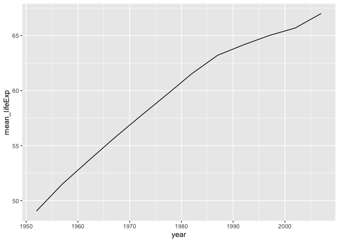
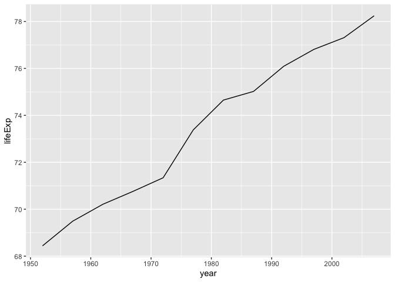

<br>

## R  Environment

### Data Used


```r
install.packages("gapminder")
```

```r
library(gapminder)
```

### Libraries Used


```r
install.packages("tidyverse")
install.packages("knitr")
```


```r
library(tidyverse)
library(knitr)
```
<br>

```r
# The use of the knitr libray allows for clean html tables. For best viewing, please open `Practice Miderm.html`
```


<br><br>

## Part 1: Data structure
**1. Use the function(s) of your choice to get an idea of the overall structure of the data frame, including its dimensions, column names, variable classes, etc.**


```r
glimpse(gapminder)
```

```
## Observations: 1,704
## Variables: 6
## $ country   <fct> Afghanistan, Afghanistan, Afghanistan, Afghanistan, Afghani…
## $ continent <fct> Asia, Asia, Asia, Asia, Asia, Asia, Asia, Asia, Asia, Asia,…
## $ year      <int> 1952, 1957, 1962, 1967, 1972, 1977, 1982, 1987, 1992, 1997,…
## $ lifeExp   <dbl> 28.801, 30.332, 31.997, 34.020, 36.088, 38.438, 39.854, 40.…
## $ pop       <int> 8425333, 9240934, 10267083, 11537966, 13079460, 14880372, 1…
## $ gdpPercap <dbl> 779.4453, 820.8530, 853.1007, 836.1971, 739.9811, 786.1134,…
```
<br>

```r
summary(gapminder)
```

```
##         country        continent        year         lifeExp     
##  Afghanistan:  12   Africa  :624   Min.   :1952   Min.   :23.60  
##  Albania    :  12   Americas:300   1st Qu.:1966   1st Qu.:48.20  
##  Algeria    :  12   Asia    :396   Median :1980   Median :60.71  
##  Angola     :  12   Europe  :360   Mean   :1980   Mean   :59.47  
##  Argentina  :  12   Oceania : 24   3rd Qu.:1993   3rd Qu.:70.85  
##  Australia  :  12                  Max.   :2007   Max.   :82.60  
##  (Other)    :1632                                                
##       pop               gdpPercap       
##  Min.   :     60011   Min.   :   241.2  
##  1st Qu.:   2793664   1st Qu.:  1202.1  
##  Median :   7023596   Median :  3531.8  
##  Mean   :  29601212   Mean   :  7215.3  
##  3rd Qu.:  19585222   3rd Qu.:  9325.5  
##  Max.   :1318683096   Max.   :113523.1  
## 
```


<br>
**2. Are there any NA's in the data?**


```r
anyNA(gapminder)
```

```
## [1] FALSE
```
There are no NA values present in the data.

<br><br>

## Part 2: Three versions of the `gampminder` data  


### Load `gapminder` as a data frame

```r
gapminder <- gapminder
```

<br>

### Long `gapminder`

**3. Make a new data frame `gapminder_long` that combines the three measured values (lifeExp, pop, gdpPercap) into a single column associated with a country and year.**

<br>

I will use the `gapminder_long()` function to make three levels of the new variable "measure" and place them all in their own row.
Then I will use the `unite()` function to combine the year with its associated measure.

```r
gapminder_long <- gapminder %>%
  
  pivot_longer(
    lifeExp:gdpPercap,
    names_to = "measure",
    values_to = "value") %>% 
  
  unite("year_measure", c("year", "measure"), sep = "_")
```
<br>
The final result is the following data frame.


```r
kable(head(gapminder_long, n=5))
```


country       continent   year_measure             value
------------  ----------  ---------------  -------------
Afghanistan   Asia        1952_lifeExp           28.8010
Afghanistan   Asia        1952_pop          8425333.0000
Afghanistan   Asia        1952_gdpPercap        779.4453
Afghanistan   Asia        1957_lifeExp           30.3320
Afghanistan   Asia        1957_pop          9240934.0000
<br>


**4. For practice, use `pivot_wider()` to put the data back into the original `gapminder` format.**

<br>
First I will separate `year_measure` into two separate columns, `year` and `measure`. Then I will use `pivot_wider()` to restore the dataset to its original form.


```r
gapminder_original_from_long <- gapminder_long %>% 
  separate(year_measure, into=c("year", "measure"), sep="_") %>% 
    pivot_wider(
    names_from = measure,
    values_from = value)
```

<br>
Now to compare `my_gapminder_original` with `gapminder`

```r
kable(head(gapminder_original_from_long, n=5))
```


country       continent   year    lifeExp        pop   gdpPercap
------------  ----------  -----  --------  ---------  ----------
Afghanistan   Asia        1952     28.801    8425333    779.4453
Afghanistan   Asia        1957     30.332    9240934    820.8530
Afghanistan   Asia        1962     31.997   10267083    853.1007
Afghanistan   Asia        1967     34.020   11537966    836.1971
Afghanistan   Asia        1972     36.088   13079460    739.9811

```r
kable(head(gapminder, n=5))
```


country       continent    year   lifeExp        pop   gdpPercap
------------  ----------  -----  --------  ---------  ----------
Afghanistan   Asia         1952    28.801    8425333    779.4453
Afghanistan   Asia         1957    30.332    9240934    820.8530
Afghanistan   Asia         1962    31.997   10267083    853.1007
Afghanistan   Asia         1967    34.020   11537966    836.1971
Afghanistan   Asia         1972    36.088   13079460    739.9811

<br>

### Wide `gapminder`
**5. Make a new data frame `gapminder_wide` that has all observations for each country in a single row. The column names should be named as "observation_year". Arrange them sequentially by year.**


```r
gapminder_wide <- gapminder %>% 
  pivot_longer(
    lifeExp:gdpPercap,
    names_to = "measure",
    values_to = "values") %>% 
  unite("observation_year", c("measure", "year"), sep = "_") %>% 
  pivot_wider(
    names_from = observation_year,
    values_from = values)
```
<br>
A preview of the `grapminder_wide` data frame:

```r
kable(gapminder_wide[1:5,1:10])
```


country       continent    lifeExp_1952   pop_1952   gdpPercap_1952   lifeExp_1957   pop_1957   gdpPercap_1957   lifeExp_1962   pop_1962
------------  ----------  -------------  ---------  ---------------  -------------  ---------  ---------------  -------------  ---------
Afghanistan   Asia               28.801    8425333         779.4453         30.332    9240934          820.853         31.997   10267083
Albania       Europe             55.230    1282697        1601.0561         59.280    1476505         1942.284         64.820    1728137
Algeria       Africa             43.077    9279525        2449.0082         45.685   10270856         3013.976         48.303   11000948
Angola        Africa             30.015    4232095        3520.6103         31.999    4561361         3827.940         34.000    4826015
Argentina     Americas           62.485   17876956        5911.3151         64.399   19610538         6856.856         65.142   21283783


**6. For practice, use `pivot_longer()` to put the data back into the original `gapminder` format. Hint: you can't do this in one step!**


```r
gapminder_original_from_wide <- gapminder_wide %>% 
  pivot_longer(-c(country,continent),
               names_to = "observation_year",
               values_to =  "value") %>% 
  separate(observation_year, into = c("observation", "year"), sep="_") %>% 
  pivot_wider(
    names_from = observation,
    values_from = value)
```

Now to compare:


```r
kable(head(gapminder_original_from_wide), n=5)
```


country       continent   year    lifeExp        pop   gdpPercap
------------  ----------  -----  --------  ---------  ----------
Afghanistan   Asia        1952     28.801    8425333    779.4453
Afghanistan   Asia        1957     30.332    9240934    820.8530
Afghanistan   Asia        1962     31.997   10267083    853.1007
Afghanistan   Asia        1967     34.020   11537966    836.1971
Afghanistan   Asia        1972     36.088   13079460    739.9811
Afghanistan   Asia        1977     38.438   14880372    786.1134

```r
kable(head(gapminder), n=5)
```


country       continent    year   lifeExp        pop   gdpPercap
------------  ----------  -----  --------  ---------  ----------
Afghanistan   Asia         1952    28.801    8425333    779.4453
Afghanistan   Asia         1957    30.332    9240934    820.8530
Afghanistan   Asia         1962    31.997   10267083    853.1007
Afghanistan   Asia         1967    34.020   11537966    836.1971
Afghanistan   Asia         1972    36.088   13079460    739.9811
Afghanistan   Asia         1977    38.438   14880372    786.1134


## Part 3: Data summaries


**7. How many different continents and countries are represented in the data? Provide the total number and their names.**


```r
world_summary <- gapminder_long %>% summarize(
  total_countries = n_distinct(country),
  total_continents = n_distinct(continent)
)
```


```r
kable(world_summary, align = "l")
```


total_countries   total_continents 
----------------  -----------------
142               5                


<br>


```r
kable(levels(gapminder_long$continent), col.names = "Levels of `continent`")
```


|Levels of `continent` |
|:---------------------|
|Africa                |
|Americas              |
|Asia                  |
|Europe                |
|Oceania               |

<br>


```r
kable(levels(gapminder_long$country), col.names = "Levels of `country`")
```


|Levels of `country`      |
|:------------------------|
|Afghanistan              |
|Albania                  |
|Algeria                  |
|Angola                   |
|Argentina                |
|Australia                |
|Austria                  |
|Bahrain                  |
|Bangladesh               |
|Belgium                  |
|Benin                    |
|Bolivia                  |
|Bosnia and Herzegovina   |
|Botswana                 |
|Brazil                   |
|Bulgaria                 |
|Burkina Faso             |
|Burundi                  |
|Cambodia                 |
|Cameroon                 |
|Canada                   |
|Central African Republic |
|Chad                     |
|Chile                    |
|China                    |
|Colombia                 |
|Comoros                  |
|Congo, Dem. Rep.         |
|Congo, Rep.              |
|Costa Rica               |
|Cote d'Ivoire            |
|Croatia                  |
|Cuba                     |
|Czech Republic           |
|Denmark                  |
|Djibouti                 |
|Dominican Republic       |
|Ecuador                  |
|Egypt                    |
|El Salvador              |
|Equatorial Guinea        |
|Eritrea                  |
|Ethiopia                 |
|Finland                  |
|France                   |
|Gabon                    |
|Gambia                   |
|Germany                  |
|Ghana                    |
|Greece                   |
|Guatemala                |
|Guinea                   |
|Guinea-Bissau            |
|Haiti                    |
|Honduras                 |
|Hong Kong, China         |
|Hungary                  |
|Iceland                  |
|India                    |
|Indonesia                |
|Iran                     |
|Iraq                     |
|Ireland                  |
|Israel                   |
|Italy                    |
|Jamaica                  |
|Japan                    |
|Jordan                   |
|Kenya                    |
|Korea, Dem. Rep.         |
|Korea, Rep.              |
|Kuwait                   |
|Lebanon                  |
|Lesotho                  |
|Liberia                  |
|Libya                    |
|Madagascar               |
|Malawi                   |
|Malaysia                 |
|Mali                     |
|Mauritania               |
|Mauritius                |
|Mexico                   |
|Mongolia                 |
|Montenegro               |
|Morocco                  |
|Mozambique               |
|Myanmar                  |
|Namibia                  |
|Nepal                    |
|Netherlands              |
|New Zealand              |
|Nicaragua                |
|Niger                    |
|Nigeria                  |
|Norway                   |
|Oman                     |
|Pakistan                 |
|Panama                   |
|Paraguay                 |
|Peru                     |
|Philippines              |
|Poland                   |
|Portugal                 |
|Puerto Rico              |
|Reunion                  |
|Romania                  |
|Rwanda                   |
|Sao Tome and Principe    |
|Saudi Arabia             |
|Senegal                  |
|Serbia                   |
|Sierra Leone             |
|Singapore                |
|Slovak Republic          |
|Slovenia                 |
|Somalia                  |
|South Africa             |
|Spain                    |
|Sri Lanka                |
|Sudan                    |
|Swaziland                |
|Sweden                   |
|Switzerland              |
|Syria                    |
|Taiwan                   |
|Tanzania                 |
|Thailand                 |
|Togo                     |
|Trinidad and Tobago      |
|Tunisia                  |
|Turkey                   |
|Uganda                   |
|United Kingdom           |
|United States            |
|Uruguay                  |
|Venezuela                |
|Vietnam                  |
|West Bank and Gaza       |
|Yemen, Rep.              |
|Zambia                   |
|Zimbabwe                 |

<br>
**8. How many countries are represented on each continent?**


```r
country_summary <- gapminder_wide %>% 
  group_by(continent) %>% 
  summarize(
    total_countries = n_distinct(country))
```

```r
kable((country_summary))
```


continent    total_countries
----------  ----------------
Africa                    52
Americas                  25
Asia                      33
Europe                    30
Oceania                    2

<br>
**9. For the years included in the data, what is the mean life expectancy by continent? Arrange the results in descending order.**


```r
mean_lifeExp_continent <- gapminder %>%
  select(country, continent, year, lifeExp) %>% 
  group_by(continent) %>% 
  summarise(
    mean_lifeExp = mean(lifeExp)) %>% 
  arrange(desc(mean_lifeExp))
```


```r
kable(mean_lifeExp_continent, digits=1)
```


continent    mean_lifeExp
----------  -------------
Oceania              74.3
Europe               71.9
Americas             64.7
Asia                 60.1
Africa               48.9


<br>

**10. For the years included in the data, how has life expectancy changed in each country between 1952-2007? How does this look in the USA only?**

In all countries, it would appear that life exptectancy has increased beweeen 1952-2007. We can visualize this by taking the mean `lifeExp` for all countries, grouping by year, and displaying the results on a line graph.


```r
allcountry_lifeExp <- gapminder %>% 
  select(country, year, lifeExp)

kable(head(allcountry_lifeExp, n=20))
```


country        year   lifeExp
------------  -----  --------
Afghanistan    1952    28.801
Afghanistan    1957    30.332
Afghanistan    1962    31.997
Afghanistan    1967    34.020
Afghanistan    1972    36.088
Afghanistan    1977    38.438
Afghanistan    1982    39.854
Afghanistan    1987    40.822
Afghanistan    1992    41.674
Afghanistan    1997    41.763
Afghanistan    2002    42.129
Afghanistan    2007    43.828
Albania        1952    55.230
Albania        1957    59.280
Albania        1962    64.820
Albania        1967    66.220
Albania        1972    67.690
Albania        1977    68.930
Albania        1982    70.420
Albania        1987    72.000

Mean life expectancy of all countries across time represented graphically:

```r
gapminder %>% 
  select(country, year, lifeExp) %>% 
  group_by(year) %>% 
  summarize(mean_lifeExp = mean(lifeExp)) %>% 
  ggplot(mapping=aes(x=year, y=mean_lifeExp))+geom_line()
```

<!-- -->


In the United States, the life expectancy also follows the trend of increasing as time goes on. However, when compared the mean life expectancy for the entire world per year, it is much higher.

```r
lifeExp_US <- gapminder %>% 
  select(country, year, lifeExp) %>% 
  filter(country=="United States")
```


```r
lifeExp_US
```

```
## # A tibble: 12 x 3
##    country        year lifeExp
##    <fct>         <int>   <dbl>
##  1 United States  1952    68.4
##  2 United States  1957    69.5
##  3 United States  1962    70.2
##  4 United States  1967    70.8
##  5 United States  1972    71.3
##  6 United States  1977    73.4
##  7 United States  1982    74.6
##  8 United States  1987    75.0
##  9 United States  1992    76.1
## 10 United States  1997    76.8
## 11 United States  2002    77.3
## 12 United States  2007    78.2
```
<br>
Represented graphically:

```r
ggplot(lifeExp_US, mapping=aes(x=year, y=lifeExp))+geom_line()
```

<!-- -->


<br>
**11. In the year 2007, which countries had a life expectancy between 70 and 75 years?**


```r
lifeExp_2007 <- gapminder %>% 
  select(country, year, lifeExp) %>% 
  filter(year== 2007) %>% 
  filter(lifeExp >=70 & lifeExp <=75) %>% 
  select(country)
```
<br>
Countries in 2007 with life expectance between 70-75:

```r
kable(lifeExp_2007)
```


|country                |
|:----------------------|
|Algeria                |
|Bosnia and Herzegovina |
|Brazil                 |
|Bulgaria               |
|China                  |
|Colombia               |
|Dominican Republic     |
|Ecuador                |
|Egypt                  |
|El Salvador            |
|Guatemala              |
|Honduras               |
|Hungary                |
|Indonesia              |
|Iran                   |
|Jamaica                |
|Jordan                 |
|Lebanon                |
|Libya                  |
|Malaysia               |
|Mauritius              |
|Montenegro             |
|Morocco                |
|Nicaragua              |
|Paraguay               |
|Peru                   |
|Philippines            |
|Romania                |
|Saudi Arabia           |
|Serbia                 |
|Slovak Republic        |
|Sri Lanka              |
|Syria                  |
|Thailand               |
|Tunisia                |
|Turkey                 |
|Venezuela              |
|Vietnam                |
|West Bank and Gaza     |

<br>
**12. In 1997, what are the minimum, maximum, and mean life expectancies of the Americas and Europe?**


```r
lifeExp_west <- gapminder %>% 
  select(country, continent, year, lifeExp) %>% 
  filter(year==1997) %>%
  filter(continent=="Europe" | continent=="Americas") %>% 
  summarize(
    min_lifeExp = min(lifeExp),
    max_lifeExp = max(lifeExp),
    mean_lifeExp = mean(lifeExp)) 
```


```r
kable(lifeExp_west, digits=2, align="l")
```


min_lifeExp   max_lifeExp   mean_lifeExp 
------------  ------------  -------------
56.67         79.39         73.53        

<br>

**13. Which countries had the smallest populations in 1952? How about in 2007?** 


```r
pop_1952 <- gapminder %>% 
  select(country, year, pop) %>% 
  filter(year==1952) %>% 
  arrange(pop)
```


```r
pop_2007 <- gapminder %>% 
  select(country, year, pop) %>% 
  filter(year==2007) %>% 
  arrange(pop)
```

<br>
In 1952, the 3 countries with the smallest populations were: Sao Tome and Principe, Djibouti, and Bahrain.

```r
kable(top_n(pop_1952, n=-5, pop))
```


country                  year      pop
----------------------  -----  -------
Sao Tome and Principe    1952    60011
Djibouti                 1952    63149
Bahrain                  1952   120447
Iceland                  1952   147962
Comoros                  1952   153936

In 2007, the 3 countries with the smallest populations were: Sao Tome and Principe, Iceland,  and Djibouti.

```r
kable(top_n(pop_2007, n=-5, pop))
```


country                  year      pop
----------------------  -----  -------
Sao Tome and Principe    2007   199579
Iceland                  2007   301931
Djibouti                 2007   496374
Equatorial Guinea        2007   551201
Montenegro               2007   684736

<br>
**14. We are interested in the GDP for countries in the Middle East including all years in the data. First, separate all of the countries on the "Asia" continent. How many countries are listed and what are their names?**


```r
asia_country_gdpPercap <- gapminder %>% 
  select(country, continent, year, gdpPercap) %>% 
  filter(continent=="Asia") %>% 
  droplevels()
```
<br>
The number of countries in Asia:

```r
nlevels(asia_country_gdpPercap$country)
```

```
## [1] 33
```
The names of countries in Asia:

```r
levels(asia_country_gdpPercap$country)
```

```
##  [1] "Afghanistan"        "Bahrain"            "Bangladesh"        
##  [4] "Cambodia"           "China"              "Hong Kong, China"  
##  [7] "India"              "Indonesia"          "Iran"              
## [10] "Iraq"               "Israel"             "Japan"             
## [13] "Jordan"             "Korea, Dem. Rep."   "Korea, Rep."       
## [16] "Kuwait"             "Lebanon"            "Malaysia"          
## [19] "Mongolia"           "Myanmar"            "Nepal"             
## [22] "Oman"               "Pakistan"           "Philippines"       
## [25] "Saudi Arabia"       "Singapore"          "Sri Lanka"         
## [28] "Syria"              "Taiwan"             "Thailand"          
## [31] "Vietnam"            "West Bank and Gaza" "Yemen, Rep."
```


<br>
**15. Next, remove all of the countries from this list that are part of the Middle East and put them into a new object `gapminder_middleEast`. Add a new column to the data called "region" and make sure "Middle East" is specified for these countries.**


```r
gapminder_middleEast <- asia_country_gdpPercap %>% 
  filter(country %in% c("Bahrain", "Iraq", "Israel", "Iran", "Jordan", "Kuwait", "Lebanon", "Oman", "Syria", "West Bank and Gaza", "Yemen, Rep.")) %>% 
  mutate(region="Middle East")
```
<br>
A preview of `gapminder_middleEast`

```r
kable(head(gapminder_middleEast, n=5))
```


country   continent    year   gdpPercap  region      
--------  ----------  -----  ----------  ------------
Bahrain   Asia         1952    9867.085  Middle East 
Bahrain   Asia         1957   11635.799  Middle East 
Bahrain   Asia         1962   12753.275  Middle East 
Bahrain   Asia         1967   14804.673  Middle East 
Bahrain   Asia         1972   18268.658  Middle East 


<br>
**16. Now show the gdpPercap for each country with the years as column names; i.e. one row per country.**


```r
gapminder_middleEast_wide <- gapminder_middleEast %>% 
  pivot_wider(
    names_from = year,
    values_from = gdpPercap)
```


```r
gapminder_middleEast_wide
```

```
## # A tibble: 11 x 15
##    country continent region `1952` `1957` `1962` `1967` `1972` `1977` `1982`
##    <fct>   <fct>     <chr>   <dbl>  <dbl>  <dbl>  <dbl>  <dbl>  <dbl>  <dbl>
##  1 Bahrain Asia      Middl… 9.87e3 1.16e4 12753. 14805. 1.83e4 19340. 19211.
##  2 Iran    Asia      Middl… 3.04e3 3.29e3  4187.  5907. 9.61e3 11889.  7608.
##  3 Iraq    Asia      Middl… 4.13e3 6.23e3  8342.  8931. 9.58e3 14688. 14518.
##  4 Israel  Asia      Middl… 4.09e3 5.39e3  7106.  8394. 1.28e4 13307. 15367.
##  5 Jordan  Asia      Middl… 1.55e3 1.89e3  2348.  2742. 2.11e3  2852.  4161.
##  6 Kuwait  Asia      Middl… 1.08e5 1.14e5 95458. 80895. 1.09e5 59265. 31354.
##  7 Lebanon Asia      Middl… 4.83e3 6.09e3  5715.  6007. 7.49e3  8660.  7641.
##  8 Oman    Asia      Middl… 1.83e3 2.24e3  2925.  4721. 1.06e4 11848. 12955.
##  9 Syria   Asia      Middl… 1.64e3 2.12e3  2193.  1882. 2.57e3  3195.  3762.
## 10 West B… Asia      Middl… 1.52e3 1.83e3  2199.  2650. 3.13e3  3683.  4336.
## 11 Yemen,… Asia      Middl… 7.82e2 8.05e2   826.   862. 1.27e3  1830.  1978.
## # … with 5 more variables: `1987` <dbl>, `1992` <dbl>, `1997` <dbl>,
## #   `2002` <dbl>, `2007` <dbl>
```


<br><br><br>
